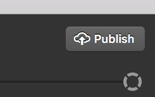
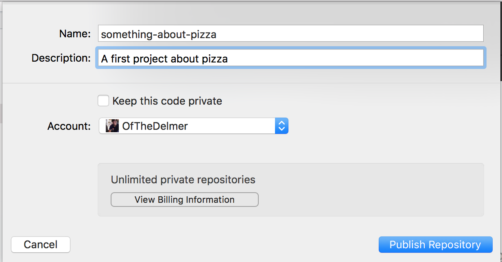
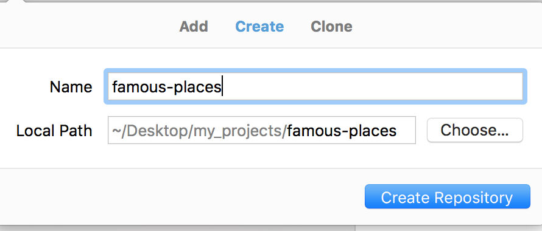

# Learn To code
## Git and GitHub

This is a fresh repository (repo) with only a README.  We'll be using it to accomplish the following.


| Objectives |
| :--- |
| Commit and track your versions of a project. |
| Fork and edit versions of a project. |
| Create a simple GitHub page. |


## Setup A GitHub Account

If you haven't already create a GitHub account.

## Editor

For any project you should have an editor. I recommend downloading and using [Atom](https://atom.io/). Why? It has good out the of the box hints for projects using Git and is popular.

## Terms Discussion

* Repo or repository
* Local repository
* Remote repository
* Git
* GitHub
* GitHub Desktop
* Terminal

## Download GitHub Desktop

You should begin downloading GitHub desktop.

* [Download Github Desktop](https://desktop.github.com/)
* Open GitHub Desktop and continue through it's setup process.
  * Connect to GitHub using your **Login** and **Password**.
  * Configure Git with your email.
  * Finish up and skip the tutorial.

## Downloading A Repo

Let's download our first project.

### Getting Organized

Before we download or create any project we should create a folder to help us remember where we have them all.

* Make a folder on your **Desktop** for all your future projects.
  * Call it `my_projects`

This will just help us stay organized.

### Downloading

Now that we have a place to put our projects we can download an existing one.

* Go to the [`pizza project`](https://github.com/nyc-learn-to-code/pizza) on GitHub.
*  Click the green `Clone or download` button in the upper right hand corner.
* **Select the Download ZIP**.
* Move the `pizza-master` folder from your `Downloads` to your `Desktop` folder called `my_projects`.

Remember moving the project from the `Downloads` to your `Desktop/my_projects` folder is just to help you stay organized.

### Opening In GitHub Desktop

* Open the `my_projects` folder and locate your `pizza-master` project.
* Drag the `pizza-master` project to your **GitHub Desktop** application.

You should be prompted to initialize a new project. This is because downloading the project does not retain any of the *Git* information. Effectively, this is a new project.

### Editing

You'll want to edit the `pizza-master/README.md` file to add your own list of favorite toppings.

You should drag the `pizza-master` folder to your editor to open it.

> You can also open atom add click `File > Open...` or on windows `File > Open Folder` and select your `Desktop/my_projects/pizza-master` folder.


Your `README` file should look like the following.

`README.md`

```markdown
# Learn To Code
## Love For Pizza

My favorite pizza toppings are...

```

You should edit it by adding your own favorite toppings like the following.

`README.md`

```markdown
# Learn To Code
## Love For Pizza

My favorite pizza toppings:

* Cheese
* More Cheese
* Even more cheese
```

Once you add your own favorite toppings you should save your changes.

### Committing

 This is a good stopping point to make your first commit.

* **Commit**: A commit stores the current contents of your project with message describing the changes. The message that goes along with a commit is called a **Commit Message**.

 > If you new files to commit in Atom then they will show up as green. It's a nice reminder.

Let's commit the file you edited. Fill out the **Summary** and **Description** of the changes then click **Commit to master**.

 

A Good commit message summary always starts with a **verb** describing the change in an imperative form:

* `Add a project readme`
* `Remove old comments in code`
* `Update project dependancies`
* `Fix search logic to include cute kittens`
* `Refactor legacy search logic`

Avoid other verb forms

* `Removing old comments`
* `Updated project dependancies`
* `More fixes to help searching for kittens`

Use your message description to explain **why** you are making the change. Briefly describe what changed also.

A good first commit can read as follows:

* Summary: Add project readme.
* Description: Adds a readme with a list of my favorite pizza toppings.

### Syncing to GitHub

Now we are ready to sync our changes to our own GitHub accounts.

* Click the `Publish` button in GitHub Desktop.



* Add a project name and description.



* Then click the publish repository button.


### View On GitHub

Now you should be able to view your first project on GitHub. If you go to GitHub and look under your repositories tab.


## Your Turn: Publishing

### Famous Places

* Open the GitHub Desktop application (if it's not open already).
* Click `File > New Repository` to create a new repository.
* Give it the name `famous-places`



* Make sure you choose 'Local Path' to be your `~/Desktop/my_projects` folder. This will help you remember where it is latter.

* Open your `famous-places` project in Atom or your editor of choice by dragging it from your `Desktop/my_projects` folder to your editor.

* Once it's open you can click create a new file by going to `File > New File` or hitting `CMD + N`.

* In the empty file write the following with your favorite places in the world.

```
# Famous Places

My favorite famous places in the world are the following:

* a place
* another place
* yet another place
```

* Then save the file by hitting `CMD + s` or clicking `File > Save` and saving the file as `README.md`.
* Go back to GitHub Desktop and review your changes.
* Write a commit summary and description and commit to master.
* Click publish.
* Give the project a name and description and publish.
* View the project on GitHub and verify it has your favorite changes.

### Repeat

Repeat the process for creating a project from scratch with a theme all your own.
